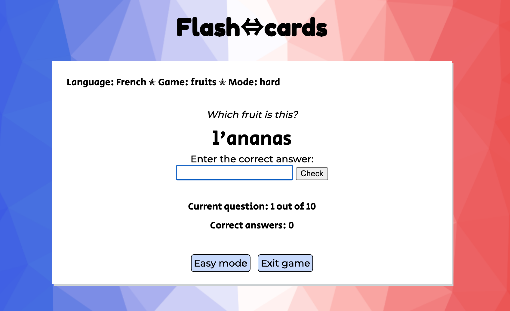

# Flashcards

## About the game

Flashcards is an interactive web-based quiz game which helps English-speaking learners of French as a foreign language to memorise vocabulary.  

The game displays a word in French, and the user's task is to enter the correct English equivalent. Users can choose between a multiple choice game ('easy mode'), where they are given a word in French and four possible English answers to choose from, or a 'hard mode' version where they are given only the French word and type their own answer in a text field. 

The computer checks whether or not the user's answers are correct, keeps a tally of correct answers and number of questions asked, and once the user has answered 10 questions the game finishes and they are given their score out of 10.

The game is live at <a href="https://charleymroberts.github.io/flashcards/index.html">https://charleymroberts.github.io/flashcards/index.html</a>

## Users of this game

The game is intended as a tool to help people learning a foreign language to memorise vocabulary.  In its current form it is most likely to be helpful to beginner-to-intermediate language learners.  

As it is fairly simple to play and also mobile-friendly, it lends itself to being played whenever the user has a spare few minutes to spend time looking at their phone, although it can be played equally well on a laptop or desktop computer.  

It is more likely to be used by adults, or teenagers studying for exams, as the visual design is fairly simple and it does not have the kind of graphics or effects that a children's game would be likely to require to keep their interest. 

## Screenshots of the user interface


## Features

### Landing page


The game begins with a landing page, where the user can select their language, select a game (i.e. choose a topic for the vocabulary), and choose whether they want to play in easy mode or hard mode.

The landing page menus are not functional as such as there is currently only one language and one game to choose from, but they are in place to demonstrate how the user might choose between different languages and games once there are more options available in a future version of the game.  

The 'easy mode' and 'hard mode' buttons at the bottom of the page are href links which take the user to each version of the game.

### Easy mode


**Question and answer area**

The page displays a question word, chosen at random from an array of word pairs, and four possibly multiple choice answers (including the correct one!).  The user selects their answer by clicking or tapping one of the answer buttons.

**Score area**

The score area at the bottom lets the user see how many questions they have scored correctly so far, and how many are left to go. (I chose not to include a 'wrong answers' tally as well as I felt it was more encouraging to learners just to display the number of correct ones.)

**Game info section**

There is also an info section in the top left hand corner to give feedback to the user about which language, game and difficulty level they are currently playing.

**Alerts for correct and incorrect answer feedback**

After each question is answered, an alert is displayed with the text "Yay, you got it right!" for a correct answer, or "You chose (answer). The correct answer is (answer). Keep trying!" if the user's choice was incorrect.  The feedback is encouraging for the user if they get an answer right, and helps them to learn the correct answer by displaying it if their own choice was incorrect.


**Game over alert**

After the user has answered 10 questions, an alert is displayed telling the user how many questions they have answered correctly. The game then resets back to the beginning. The user can either play another game, or use the navigation buttons within the game to switch to hard mode or exit the game (which takes the user back to the landing page).


### Hard mode

The layout and functioning of the game from the user's perspective is similar to easy mode as described above. The main difference is that instead of multiple choice buttons, the user has a text field in which to type their answer.



## Design considerations

### Useability

The design is kept deliberately simple so it does not distract from learning. This should also help keep it quick to load and use minimal mobile data. 

It is designed to have sufficient contrast between colours and use clearly readable fonts for accessibility purposes.  Two fonts are used in the body of the game, one for the information provided by the game and the other for instructions to the user, to help navigating the game feel intuitive. 

It is designed to be mobile-friendly as it is the kind of game people would play on their phone when they have a spare few minutes.  As a fairly simple design it has not needed much adaptation for different screen sizes, just one min-width media query for a couple of differences between touchscreens and desktop/laptop screens (one for how much screen width the white background to the game takes up, and another to implement the 'hover' command on screens which are being used with mouse pointers). 

### Visual design

The colour scheme is based around the flag of France. (Other national flag colours of French-speaking countries could be used if the game was being marketed outside Europe, and additional colour schemes could be added as further languages are added to the game).  As the game is not specifically aimed at children it does not include extras such as pictures, moving images or sound effects.

The logo font was chosen to be bold to attract the user's attention when they first arrive at the page, and distinguish it from the body of the game.  The body fonts aim to be unfussy and readable but also feel sufficiently modern.

The white game area background (with a slight drop shadow) is inspired by traditional paper flashcards which would have one language on one side and the other language on the other side, and the two-directional arrows in the logo are to signify turning the flashcard over to check the answer.

The background was created using a site called Trianglify, which aims to enable users to create website backgrounds that are more appealing than just a plain colour without needing access to specially created images.

## Technologies used

The game is written using JavaScript, displayed using HTML and styled with CSS.

I chose to take a modular approach to the JavaScript, with separate files for the two versions of the game, as the majority of the code was different for the two games.  I decided keeping the code separate would be clearer and easier to maintain in future, rather than having to spend time identifying which pieces of code within the same file belonged to which game.  I then decided to have the array of word pairs as a separate file, which would also make it much simpler to add further arrays and languages to future versions of the game.

## Testing undertaken

I reguarly checked the functioning and design of the game throughout its development. I used the DevTools checker for various sizes of phone and tablet screens to check the responsiveness of the design during initial stages of development, and checked the functioning and design again on actual phones and tablets once it was deployed to GitHub Pages.  The design is tested down to a width of 320px (e.g. smaller phone screens).

### Checkers used and results

I put each page of the game through the <a href="https://validator.w3.org/">W3C HTML validator</a>, the <a href="https://jigsaw.w3.org/css-validator/">W3C Jigsaw CSS validator</a> and Lighthouse within Chrome Devtools, and the JavaScript files into the <a href="https://jshint.com/">JShint JavaScript checker</a>.  

| Page          |   Checker          |  Result   |
|---------------|------------------- |-----------|
| index.html    | W3C HTML validator | 'No errors or warnings to show' |
|               | W3C CSS validator  | 'No Error Found' | 
|               | Lighthouse         | 100% for accessibility |
|               |                    |           |
| hardmode.html | W3C HTML validator | 'No errors or warnings to show' |
|               | W3C CSS validator  | 'No Error Found' | 
|               | Lighthouse         | 100% for accessibility |
|               |                    |           |
| easymode.html | W3C HTML validator | 'No errors or warnings to show' |
|               | W3C CSS validator  | 'No Error Found' | 
|               | Lighthouse         | 100% for accessibility |

| File           | Checker  | Result             |
|----------------|----------|--------------------|
| script-hard.js | JShint   | no warnings shown* |    
| script.easy.js | JShint   | no warning shown*  |    

*once JShint configured to 'Assume: New JavaScript Features (ES6)'  

## Deployment

The game was developed in Gitpod and deployed to GitHub Pages. The process for doing this is:

- On the GitHub page for the project, go to the 'Settings' menu
- Go to the 'Pages' section
- Under 'Build and deployment > Branch', select 'main'
- Click 'Save'

## Bugs

### Fixed bugs

I noticed that phones automatically add a space at the end of a word if the user selects the word using autocomplete, which was making the game return incorrect answers in hard mode as the strings were no longer an exact match. I added a `.trim()` method to the user input in the JavaScript to fix the problem by removing any white space from the end of words.  I had already added a `.toLowerCase()` method so the game did not return an incorrect answer if the user (or their phone's autocomplete) included any capital letters in their answer. 

When I added a `hover` class to the multiple choice buttons to change their background colour while the user's mouse pointer was over them, I found that this led to the buttons on touchscreens being displayed in the hover background colour after the question had been answered and when the next question was displayed.  To get around this problem I put the `hover` class inside a media query of `pointer: fine`, which only applies it on devices being operated with a mouse. 

### Unfixed bugs

At the end of the game, when the alert displays the number of questions the user answers correctly, the counter of correct answers on the page itself does not add the last answer, e.g. if the user answers 10 questions correctly, the alert says they answered 10 correctly but the counter on the page stays at 9.  Presumably this is because the alert is triggered earlier in the code before the counter has chance to increment by one.  

## Coding decisions(/features I could have added but decided not to in this release)

## Ideas for future development

The game is still in its early stages in terms of the amount of vocabulary and number of different languages it could offer. 

Future development could involve:
- adding more vocabulary covering different topics
- adding more language pairs
- adding the option to flip languages to have the questions in English and the answers in the other language
- adding some graphics to reinforce learning, e.g. an image of the fruit displayed with the correct answer

Making English the question language would involve creating some additional features in hard mode, such as a way of enabling the user to easily add accented characters or umlauts, and deciding how to score the answer if the user enters the correct word but gets its gender wrong. This could involve adding a way of checking the definite article (e.g. 'le' or 'la') separately from the word and giving the user half a point if they entered the correct word but the incorrect gender, or deciding that the entire answer would count as incorrect in that case.

## Credits

Background image created using <a href="http://trianglify.io" target="_blank">Trianglify.io</a>

Fonts from <a href="http://fonts.google.com" target="_blank">Google Fonts </a>

Submit icon from <a href="http://www.fontawesome.com" target="_blank">fontawesome</a>

<a href="http://www.collinsdictionary.com" target="_blank">Collins Dictionary</a> used to check spellings and genders of French words


Welcome Charley Roberts,

This is the Code Institute student template for Gitpod. We have preinstalled all of the tools you need to get started. It's perfectly ok to use this template as the basis for your project submissions.

You can safely delete this README.md file, or change it for your own project. Please do read it at least once, though! It contains some important information about Gitpod and the extensions we use. Some of this information has been updated since the video content was created. The last update to this file was: **September 1, 2021**

## Gitpod Reminders

To run a frontend (HTML, CSS, Javascript only) application in Gitpod, in the terminal, type:

`python3 -m http.server`

A blue button should appear to click: _Make Public_,

Another blue button should appear to click: _Open Browser_.

To run a backend Python file, type `python3 app.py`, if your Python file is named `app.py` of course.

A blue button should appear to click: _Make Public_,

Another blue button should appear to click: _Open Browser_.

In Gitpod you have superuser security privileges by default. Therefore you do not need to use the `sudo` (superuser do) command in the bash terminal in any of the lessons.

To log into the Heroku toolbelt CLI:

1. Log in to your Heroku account and go to *Account Settings* in the menu under your avatar.
2. Scroll down to the *API Key* and click *Reveal*
3. Copy the key
4. In Gitpod, from the terminal, run `heroku_config`
5. Paste in your API key when asked

You can now use the `heroku` CLI program - try running `heroku apps` to confirm it works. This API key is unique and private to you so do not share it. If you accidentally make it public then you can create a new one with _Regenerate API Key_.

------

## Release History

We continually tweak and adjust this template to help give you the best experience. Here is the version history:

**September 1 2021:** Remove `PGHOSTADDR` environment variable.

**July 19 2021:** Remove `font_fix` script now that the terminal font issue is fixed.

**July 2 2021:** Remove extensions that are not available in Open VSX.

**June 30 2021:** Combined the P4 and P5 templates into one file, added the uptime script. See the FAQ at the end of this file.

**June 10 2021:** Added: `font_fix` script and alias to fix the Terminal font issue

**May 10 2021:** Added `heroku_config` script to allow Heroku API key to be stored as an environment variable.

**April 7 2021:** Upgraded the template for VS Code instead of Theia.

**October 21 2020:** Versions of the HTMLHint, Prettier, Bootstrap4 CDN and Auto Close extensions updated. The Python extension needs to stay the same version for now.

**October 08 2020:** Additional large Gitpod files (`core.mongo*` and `core.python*`) are now hidden in the Explorer, and have been added to the `.gitignore` by default.

**September 22 2020:** Gitpod occasionally creates large `core.Microsoft` files. These are now hidden in the Explorer. A `.gitignore` file has been created to make sure these files will not be committed, along with other common files.

**April 16 2020:** The template now automatically installs MySQL instead of relying on the Gitpod MySQL image. The message about a Python linter not being installed has been dealt with, and the set-up files are now hidden in the Gitpod file explorer.

**April 13 2020:** Added the _Prettier_ code beautifier extension instead of the code formatter built-in to Gitpod.

**February 2020:** The initialisation files now _do not_ auto-delete. They will remain in your project. You can safely ignore them. They just make sure that your workspace is configured correctly each time you open it. It will also prevent the Gitpod configuration popup from appearing.

**December 2019:** Added Eventyret's Bootstrap 4 extension. Type `!bscdn` in a HTML file to add the Bootstrap boilerplate. Check out the <a href="https://github.com/Eventyret/vscode-bcdn" target="_blank">README.md file at the official repo</a> for more options.

------

## FAQ about the uptime script

**Why have you added this script?**

It will help us to calculate how many running workspaces there are at any one time, which greatly helps us with cost and capacity planning. It will help us decide on the future direction of our cloud-based IDE strategy.

**How will this affect me?**

For everyday usage of Gitpod, it doesn’t have any effect at all. The script only captures the following data:

- An ID that is randomly generated each time the workspace is started.
- The current date and time
- The workspace status of “started” or “running”, which is sent every 5 minutes.

It is not possible for us or anyone else to trace the random ID back to an individual, and no personal data is being captured. It will not slow down the workspace or affect your work.

**So….?**

We want to tell you this so that we are being completely transparent about the data we collect and what we do with it.

**Can I opt out?**

Yes, you can. Since no personally identifiable information is being captured, we'd appreciate it if you let the script run; however if you are unhappy with the idea, simply run the following commands from the terminal window after creating the workspace, and this will remove the uptime script:

```
pkill uptime.sh
rm .vscode/uptime.sh
```

**Anything more?**

Yes! We'd strongly encourage you to look at the source code of the `uptime.sh` file so that you know what it's doing. As future software developers, it will be great practice to see how these shell scripts work.

---

Happy coding!
